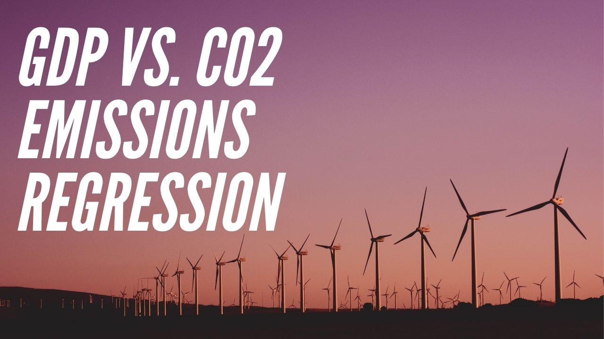

# GDP vs. CO2 Emissions - Regression

# Full Project Report
[Follow this link to the final report on this project.](https://tomasangelini.com/gdpvsco2page.html)     

# Abstract
This project seeks to investigate the correlation in countries' GDPs with their annual greenhouse gas emissions. This can be used to evaluate the economic implications of using fossil-fuels vs. renewable energy, and to assess how feasible it would be for developing countries to adopt net-zero emission policies while upholding their economic growth objectives.

## Tools Used
- Python (Numpy || Pandas || Seaborn || Scikit-learn || Statsmodels)
- Jupyter Lab

## Concepts Covered
- Data Cleaning
- Exploratory Data Analysis
	- Statistical Summaries
	- Data Distributions
	- Linear Correlation Maps
	- Scatter plots and Regression Plots
- Feature Engineering
	- Functional Transformations
	- Logarithmic Transformations
	- Parabolic relationships
	- Interaction Terms
	- Feature scaling
- Model Building
	- Linear Regression
	- Least Squares Estimation
	- Regression Analysis Metrics
	- Q-Q Plots
	- Residual Plots

## Project Links
- [Github Repo of this Project](https://github.com/TommyAngelini/Data-Science-Projects/tree/main/Projects/GDPVersusEmissions)
- [Tableau Visualization](https://public.tableau.com/app/profile/tomas.angelini/viz/GDPvsCO2EmissionsbyCountry/CountryGDPvs_CO2EmissionsDashboard)
- [Data Source](https://ourworldindata.org/grapher/co2-emissions-vs-gdp)
